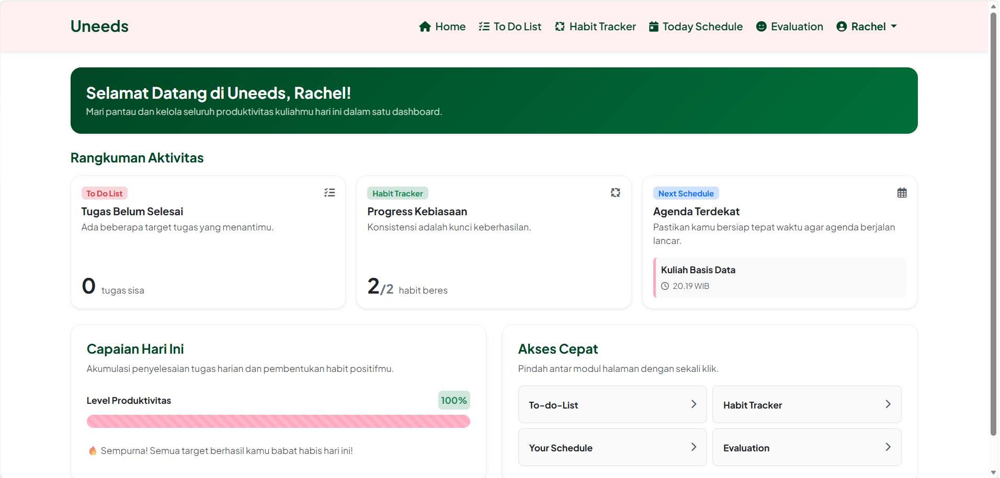
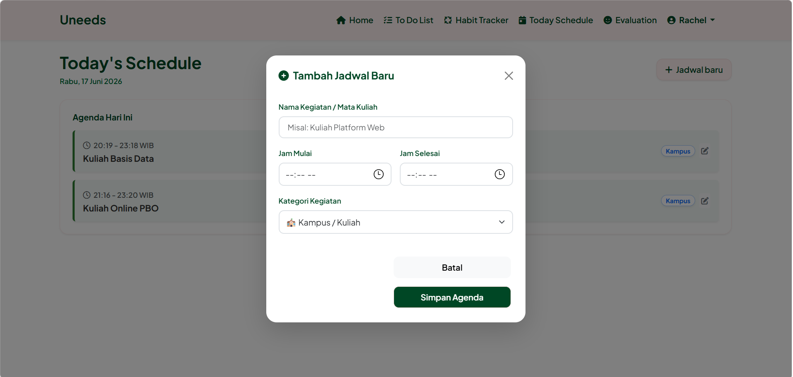
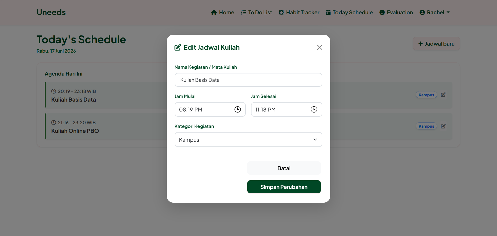
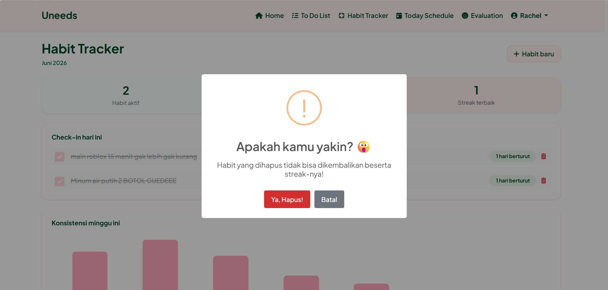
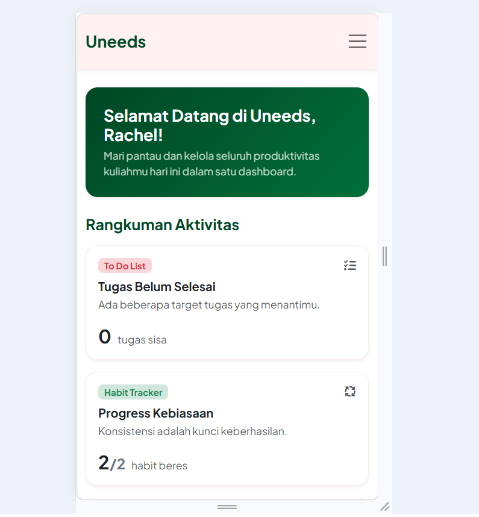

#  Uneeds - Need a Plan? Uneeds It.

Uneeds adalah aplikasi berbasis web yang dirancang khusus untuk membantu individu dalam mengelola jadwal sehari-hari, melacak tugas yang ingin dilakukan (To-Do List), serta memantau konsistensi kebiasaan positif harian (Habit Tracker). Aplikasi ini dibangun menggunakan PHP Native yang aman, Bootstrap 5 untuk tampilan yang responsif, serta interaktivitas modern menggunakan SweetAlert2.

---

## Fitur Utama
*   **Autentikasi Multi-Identifier:** Pengguna dapat masuk (*Log In*) menggunakan kombinasi `username` maupun `email` yang sudah terenkripsi aman standar industri.
*   **Today's Schedule (CRUD Lengkap):** Manajemen jadwal kuliah harian yang dilengkapi fitur tambah, edit secara real-time via manipulasi DOM JavaScript, serta pembagian kategori dengan visual warna yang estetik.
*   **Habit Tracker (Grafik & Streak):** Melacak kebiasaan harian dengan perhitungan *streak* berturut-turut otomatis, sistem penanda selesai, grafik konsistensi mingguan, serta fitur hapus data yang aman dengan konfirmasi alert.
*   **Keamanan Kode:** Proteksi halaman berbasis *Session*, pencegahan celah XSS menggunakan `htmlspecialchars()`, keamanan SQL Injection dengan `mysqli_real_escape_string`, dan enkripsi satu arah password menggunakan `password_hash()`.

---

## Teknologi yang Digunakan
*   **Language:** PHP, HTML5, CSS3, JavaScript (ES6)
*   **Framework CSS:** Bootstrap 5.3
*   **Database:** MySQL / MariaDB
*   **Library Tambahan:** SweetAlert2 (Notifikasi & Pop-up konfirmasi interaktif), FontAwesome 6 (Ikon)

---

## Cara Instalasi (Laragon / XAMPP)

1. **Clone atau Unduh Proyek:**
   Ekstrak folder proyek ini ke dalam direktori server lokal Anda:
   * Jika menggunakan Laragon: `C:\laragon\www\proyekuasppw`
   * Jika menggunakan XAMPP: `C:\xampp\htdocs\proyekuasppw`

2. **Import Database:**
   * Aktifkan Apache dan MySQL pada control panel Laragon/XAMPP Anda.
   * Buka alat manajemen database (HeidiSQL / phpMyAdmin).
   * Buat database baru bernama `proyekuasppw`.
   * Klik tab *Query* atau *Import*, lalu jalankan struktur database tabel `users`, `schedules`, dan `habits`.

3. **Konfigurasi Koneksi:**
   Pastikan file `config.php` Anda sudah mengarah ke database yang benar:

4. **Jalankan Aplikasi:**
    Buka browser kesayangan Anda dan akses URL berikut:
    http://localhost/proyekuasppw/pages/login.php


#Screenshot

### 1. Halaman Beranda & Login (Desktop)


### 2. Daftar Data & Form Tambah Jadwal


### 3. Form Edit Data (Manipulasi DOM JS)


### 4. Modul Habit Tracker & Konfirmasi Hapus Data


### 5. Tampilan Responsif (Mobile Device)


```php
   $conn = mysqli_connect("localhost", "root", "", "proyekuasppw");

